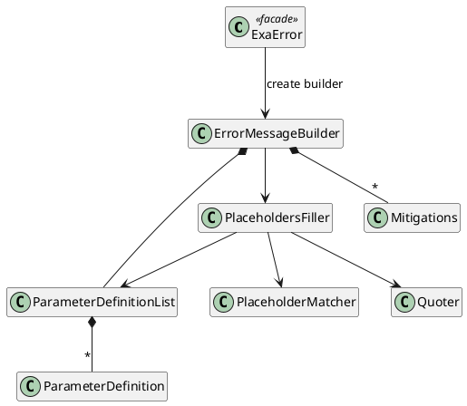

# Building Block View

## Overview

The public facade creates builders. The builder owns accumulated text and delegates parsing, parameter lookup, substitution, and quoting to focused collaborators.

## Building Blocks

### Public Facade And Builder

`ExaError` provides the static entry point. `ErrorMessageBuilder` accumulates the error code, message fragments, mitigations, and parameter definitions and assembles the final output.

### Placeholder Processing

`PlaceholderMatcher` exposes an iterable over regex matches. `Placeholder` parses the reference and switches and stores source indexes. `ParametersMapper` maps inline arguments to matched placeholders when message or mitigation text is added.

### Parameter Model

`ParameterDefinition` stores name, value, and description. `ParameterDefinitionList` provides first-match lookup and presence checks and intentionally tolerates absent or duplicate definitions.

### Rendering And Quoting

`PlaceholdersFiller` replaces placeholders or emits an unknown-placeholder diagnostic. `Quoter` formats nulls, collections, and scalar values according to automatic or explicit quoting.
