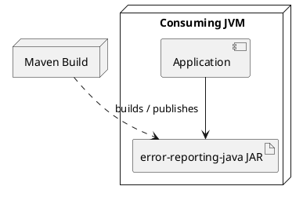

# Deployment View

## Deployment Environment

The system is packaged as a Maven Java library and loaded inside a consuming JVM application.

## Runtime Nodes

* Consuming JVM application
* Java Error Reporting library JAR
* Optional Maven build and error-code crawler tooling

## Deployment Diagram

## Deployment Strategy

Maven compiles, tests, verifies, and publishes the library. At runtime the library performs only in-process string construction and does not initiate network calls or require external state.

## Open Issues

* Supported JVM vendors and the minimum runtime beyond the Java 11 build target are not documented.
